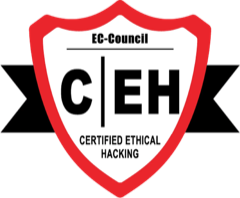
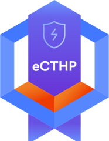
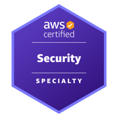

<h1 align="center">Yaakulya Sabbani</h1>

  <b>AI & Security Research Engineer</b> 
  Agentic security systems · Malware analysis · LLMs for offensive and defensive security

  
  
  
  

---

## About

- **Primary Consultant, Cybersecurity R&D** at a stealth-stage AI cyber risk startup. I design agentic AI platforms for SOC analysts, red-team orchestration systems, and autonomous dark-web exposure monitoring.
- **Security Research Assistant** at the **NYU Center for Cybersecurity** (2025 to 2026), working on retrieval-augmented vulnerability analysis and malware static analysis.
- **Bachelors, NYU Tandon School of Engineering** (Class of 2026), GPA 4.0, summa cum laude, 100% merit scholar.
- Previously **Cybersecurity Analyst** at a Canadian security firm.

## What I work on

| Area | Recent work |
|---|---|
| **Agentic security systems** | Internal AI platform grounding 656 MITRE ATT&CK triage playbooks for 54 L1/L2 analysts, with a check that blocks unsourced answers. Agentic red-team VAPT orchestrator with a kill-chain agent swarm and human-in-the-loop gates. |
| **Offensive AI & red teaming** | Agentic red-team VAPT system across Web and Network: an orchestrator that decomposes engagements into MITRE ATT&CK tasks, a kill-chain agent swarm, a shared attack-graph knowledge base, and a proof-of-exploit validator. Consolidated ~60 offensive tools to one vetted tool per capability. TEF-D3, a red-team recon framework with passive OSINT and breach validation. |
| **Malware analysis** | Static analysis framework over 160 SocGholish samples, 70+ features, YARA signature generation. Published in Springer JCVHT 2026. |
| **LLMs for defensive security** | QLoRA fine-tuning of GPT-OSS-120B on a compliance ontology, served on-prem. RAG pipelines over Qwen-2.5-Coder-32B and Falcon-H1-7B for memory corruption analysis (RAVEN, IJCNN 2026). |
| **Threat intelligence & exposure** | 28 collectors sweeping 76+ dark-web marketplaces over a custom Tor chain, delivering nightly brand-exposure reports. Vendor risk scored over NVD, EPSS, CISA KEV and MISP. |
| **GRC** | ISO 27001:2022 Stage 2 audit prep, NIST CSF 2.0 risk register, SOC 2 evidence automation with n8n. |

## Selected repositories

| Repository | What it is |
|---|---|
| [MISP-Wazuh-Threat-Intelligence-Integration](https://github.com/yaakulya123/MISP-Wazuh-Threat-Intelligence-Integration) | Wiring MISP threat intel feeds into Wazuh SIEM. |
| [Suricata-Network-Integration](https://github.com/yaakulya123/Suricata-Network-Integration) | Suricata IDS integration for network-layer detection in a SIEM stack. |
| [DoNotTrain-Prototype](https://github.com/yaakulya123/DoNotTrain-Prototype) | On-chain opt-out registry for AI training data. Only a SHA-256 and a perceptual hash leave the browser. |
| [socgholish-analysis](https://github.com/yaakulya123/socgholish-analysis) | Static analysis framework and feature matrix for 160 SocGholish samples. Companion code to the JCVHT 2026 paper. |
| [WannaCry-Forensics](https://github.com/yaakulya123/WannaCry-Forensics) | Ransomware forensics analysis toolkit. Controlled environments only. |
| [GitSecuritySuite](https://github.com/yaakulya123/GitSecuritySuite) | Repository defender and supply-chain threat auditor. |

## Publications

- **RAVEN: Retrieval-Augmented Vulnerability Exploration Network for Memory Corruption Analysis.** WCCI 2026 IJCNN Main Track (IEEE).
- **Evasion by Design: Multi-Feature Static Analysis of SocGholish's Detection-Aware Architecture.** Journal of Computer Virology and Hacking Techniques (Springer), 2026. [doi:10.1007/s11416-026-00678-1](https://doi.org/10.1007/s11416-026-00678-1)

## Certifications

<table align="center">
  <tr>
    <td align="center" width="25%">
       
      <b>Certified Ethical Hacker</b> 
      EC-Council · CEH
    </td>
    <td align="center" width="25%">
       
      <b>Certified Threat Hunting Professional</b> 
      INE Security · eCTHP
    </td>
    <td align="center" width="25%">
       
      <b>ISO/IEC 27001 Lead Auditor</b> 
      Information Security Management
    </td>
    <td align="center" width="25%">
       
      <b>AWS Certified Security</b> 
      Specialty
    </td>
  </tr>
</table>

## Recognition

- Youngest EC-Council national record holder, Indian Book of Records.
- Top 1% globally on HackerRank · Top 5% globally on TryHackMe.
- Winning team, OPUS Hackathon (NYU): agentic procurement system with human-in-the-loop email drafting.
- Winner, Computer Forensics State Training, Government of India Cyber Crime Assessment program.

## Skills

**Languages:** Python, C/C++, JavaScript/TypeScript, R, Java  
**Security:** Threat intelligence, VAPT, malware analysis, digital forensics, incident response, GRC, OSINT, attack surface management, SOC automation  
**Tools:** Splunk, Wazuh, MISP, OpenCTI, Suricata, Nessus, Burp Suite, Wireshark, MITRE ATT&CK, Tor, n8n, Docker, AWS, OpenSearch  
**AI/ML:** RAG pipelines, LLM fine-tuning (QLoRA/PEFT), LLM-as-judge evaluation, multi-agent orchestration (CrewAI, MCP), PyTorch, Hugging Face

---

He/Him · Open to research collaborations in AI security and threat intelligence.

